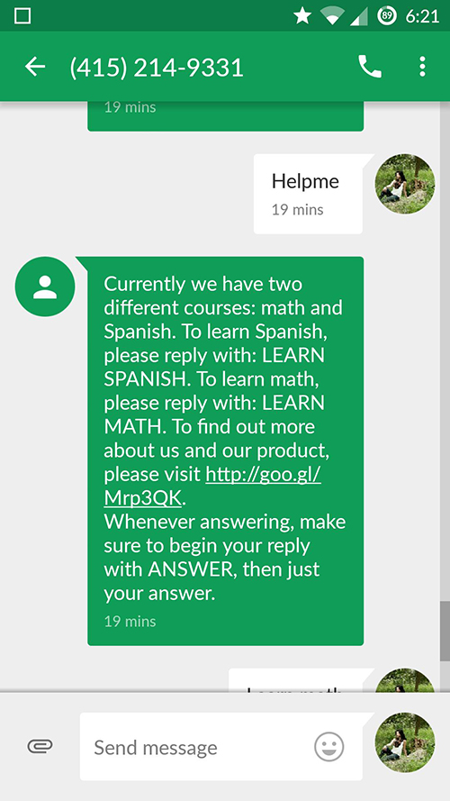

# Text2Learn
HackingEdu2015 Submission 

A project created by Leslie Li, Sarah Borland, Rosalba Rodriguez, Joyce Scalettar. 
Website for the project can be found here: [link](nguyetduong.github.io/Text2Learn)

### Images 
 

### About Our Invention
We are basing our invention off of HackingEDU 2015's theme: education. Our goal is to overcome the barriers of 
learning by making knowledge more accessible at the tip of anyone's fingertips. We are going back to the basic:
no more mobile apps, no more native web apps. Just simple SMS messages used to provide people with basic education. 

### How It Works
In a simple sense, all we are doing is:

1. Receiving SMSs
2. Sending SMSs

But in a more technical perspective, we have a database that stores all of our subscriber's phone numbers. Everyone has their own unique ID, with their own number of points (which are received upon correctly answering a question), and the number and type of questions they have answered correctly. 

The program is kept on a server, at the moment on our localhost and we are using ngrock to create a safe connection to Twilio. Using Twilio and our server, we receive a notification whenever someone sends an SMS to our number (+14152149331). We do this by cross referencing our database to see if they in the database. If they have not subscribed to our services, we notify them of this and let them know how to subscribe. 

Otherwise we will recognize the number and parse their input into tokens, and direct their message to the appropriate functions. If their input is invalid, we will prompt them to ask for help to see the valid inputs. They can access all of their database information by sending SMSs with the appropriate phrases. 

### Interesting Facts
- We sent over 1000 SMSs during our testing phase
- We spent over $200 dollars on transportation and food
- Our friends were our victims
- Rosalba almost lost all of her texts for the month

### External Resources Used
- [Twilio](https://www.twilio.com/api)
- [Bootstrap](http://getbootstrap.com/)
- [Wordnik](http://developer.wordnik.com/)
- [SQLite](https://www.sqlite.org/)
- [ngrok](https://ngrok.com/)
